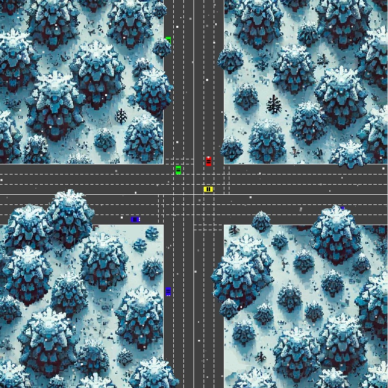

# smart-road

## Context

This is my go at [smart-road](https://github.com/01-edu/public/tree/master/subjects/smart-road), the first project of the Rust arc of the [01Edu](https://01-edu.org/) family of coding bootcamps. It consists of a traffic simulation. The idea is to show cars passing an intersection without collisions or congestion.

## Usage

[Install Rust](https://www.rust-lang.org/learn/get-started) if you haven't already.

Clone this repo by entering the command `git clone https://github.com/pjtunstall/smart-road` in a terminal. Navigate into the root directory of the project with `cd smart-road` and type `cargo run` to compile and run the program in one step.

Alternatively, you can build an executable file with `cargo build`, which will be saved in the subdirectory `target/debug`, or an optimized version with `cargo build --release`. You'll find that one saved in `target/release/smart-road`.

- Arrow keys to spawn a car traveling in the chosen direction.
- `R` to spawn a car traveling in a random direction.
- `ESC` to close the window, ending the simulation, and display some stats.
- `ESC` again to exit the program.

## Why two UI libraries?

The instructions suggested we use `sdl2`. I so did for the simulation itself, but used `druid` to show the stats at the end. I had trouble installing the sublibrary `sdl2_ttf`, which `sdl2` uses to display text. It seems many people report issues installing it on macOS. I wonder if it might be that the latest version of macOS that's compatible with my old laptop is no longer supported. In any case, after trying a few of the proposed fixes without success, I switched to a less finicky option as I wanted this program to be reliably accessible to others.

## Roadmap

Possible further deveopments include:

### Tests

Unit tests. But, more interestingly, stress tests to try to force gridlocks. Cars could be spawned at the least opportune times in the lanes most likely to cause congestion. The parameters could be adjusted to speed up the simulation for the test (and proportionately reduce the interval between cars being spawned), to give more chance of gridlock. In that case, the speed would have to be changed in a way that ensures cars don't jump through each other, e.g. by increasing the frame-rate and/or not drawing.

### Preventing gridlock: two approaches

These images were taken before I adjusted the parameters, the three speeds and `keypress_interval`, to prevent cars from being spawned in such rapid succession. Since then, I also swapped the speeds of the lanes so that they travel faster in the left and center lanes, where congestion is a risk. One way to see gridlock now is to change `keypress_interval` from 128 to 32.

One exercise would be to devise a system to guarantee that cars never have to slow down for each other. Spawns could be timed in such a way that they would always be interleaved, taking into account how long each car needs to reach and pass the potential collision spots. But that might take the simulation further from reality.

Another direction to explore would be to let the cars arrive on screen with random speeds and come up with a proper system to adjust those speeds as need be, based only on local conditions. This would make it more challenging to prevent collisions, since we couldn't simply tell a car not to move if that would cause a crash.

Also, since we wouldn't be allowing ourselves to fine tune the parameters, we'd need some rule of precedence to prevent gridlock. For the special case of cars traveling in the same lane, of course, we could give the front car priority and work back from there, checking if it's safe for each trailing car to move. This would otherwise be a danger as long as we rely on proximity alone to determine when a car should wait. We could also take into account speed and direction.

### Acceleration

In the interests of realism, we could implement smooth acceleration and braking, and a variable stopping distance, dependent on speed.

#### Other

Finally, the visual aspect could be improved, i.g. with less abrupt turns, proper sprites for the cars, fewer anomalous bits of trees cut off by the road, headlight glow, ...
